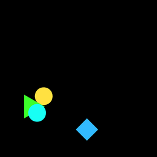
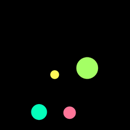
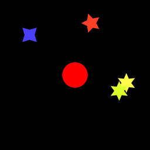
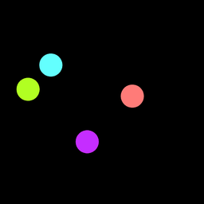

# Spriteworld-Physics: A Flexible, Configurable, Simple Physics Simulator

## Description

Spriteworld-Physics implements some basic physical forces and dynamics on top of
[Spriteworld](https://github.com/deepmind/spriteworld). It can be used to
generate simple videos of objects moving and interacting.

Spriteworld is a python-based RL environment consisting of a 2-dimensional arena
with simple shapes that can be moved around. See
[https://github.com/deepmind/spriteworld] for a more detailed description.

This library ignores the RL/agent aspect of Spriteworld, only using it for video
generation. This library introduces a number of forces/dynamics into the
environment, namely springs, gravity/magents, and collisions. See forces.py for
details.

## Examples

Below are examples of the kinds of systems Spriteworld-Physics can simulate. See
`configs/` for example configs and `run_demo.py` for how to visualize them.

Springs. Four sprites fully connected by springs. See `configs/springs.py` .



Collisions. A random number of sprites that collide and bounce off walls. See
`configs/collisions.py` .


Magnets. Four circles of various masses/charges that magnetically repel each
other and bounce off walls. See `configs/magnets.py` .



Star system. Stars orbiting a fixed center circle according to gravity. This
demonstrates the use of a non-fully-connected interaction graph. See
`configs/star_system.py` .



Colliding springs. Circles connected by springs that also collide with each
other. This demonstrates the use of two force laws simultaneously. See
`configs/colliding_springs.py` .



## Installation

Spriteworld can be installed through Github:

``` bash
pip install git+https://github.com/nwatters01/spriteworld-physics.git
```

or alternatively by checking out a local copy of our repository and running:

``` bash
git clone https://github.com/nwatters01/spriteworld-physics.git
pip install spriteworld/
```

This last option additionally downloads the demo UI and an example gif
generator script.

## Getting Started

#### Prerequisites

Spriteworld-Physics depends on `spriteworld` , `numpy` , `six` , `absl` , and
`dm_env` .

#### Running The Demo

Once installed, you may familiarize yourself with Spriteworld-Physics through
`run_demo.py` :

``` bash
python /path/to/local/spriteworld/run_demo.py
```

This will run a system of objects interacting with springs and play a video of
the environment. There are a number of other example systems defined by configs
in `spriteworld_physics/configs/` . Run the demo with flag
`--config=$path_to_task_config$` to view each of these.

#### Creating Your Own System

All available forces lie in `spriteworld_physics/forces.py` and various simple
strategies for defining interaction graphs (i.e.specifying which forces should
apply between which objects) lie in `spriteworld_physics/graph_generators.py` .
You can configure your own system by combining these, or if necessary implement
your own force or graph generator classes.

See the examples in `spriteworld_physics/configs/` for demonstrations of the
current version of this codebase's scope.

#### Generating Data

There is currently no pipeline for large-scale data-generation. However, there
is a script `spriteworld_physics/generate_gif.py` which runs a config and writes
a video of the resulting simulation to a file as a gif, which you can adapt to
generate data in your preferred format.

## Reference

This library is derivative work from Spriteworld:
``` 
@misc{spriteworld19,
author = {Nicholas Watters and Loic Matthey and Sebastian Borgeaud and Rishabh Kabra and Alexander Lerchner},
title = {Spriteworld: A Flexible, Configurable Reinforcement Learning Environment},
howpublished = {https://github.com/deepmind/spriteworld/},
url = {https://github.com/deepmind/spriteworld/},
year = "2019",
}
```

See the Spriteworld license in LICENSE-apache-2.0-derivative.

If you use this library in your work, please cite Spriteworld as above.
